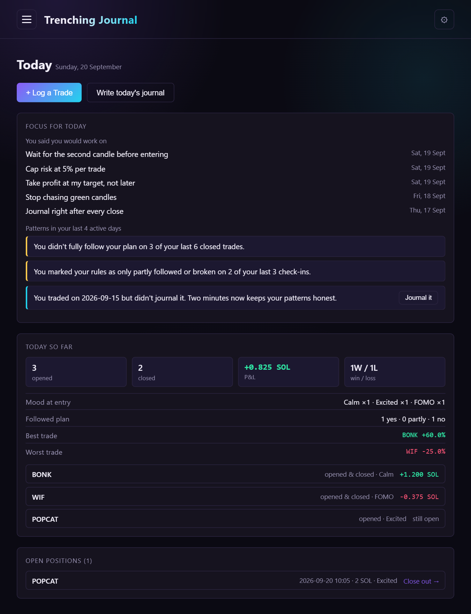
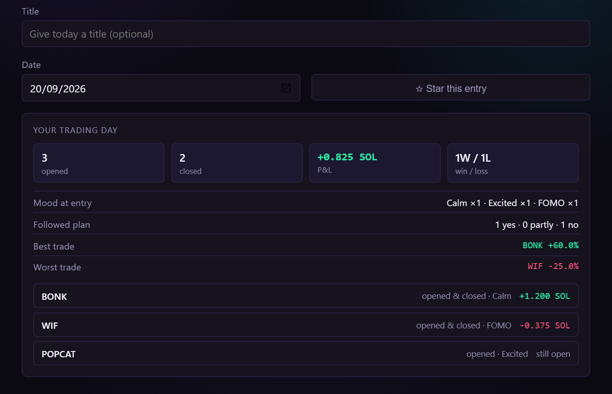
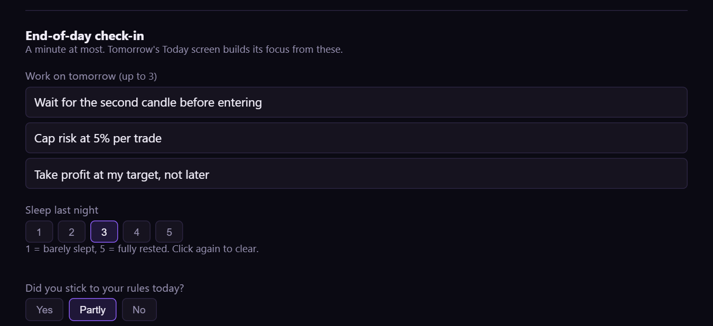
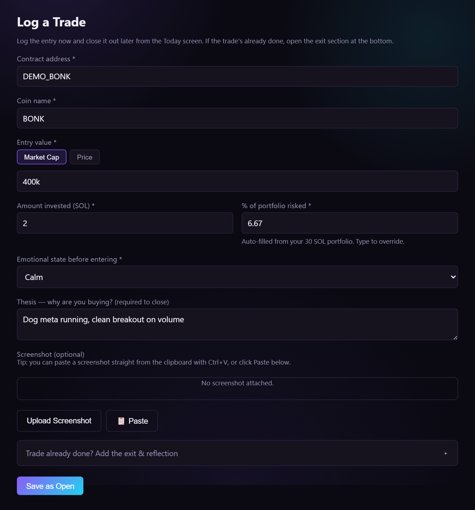

# 📓 Trenching Journal!

[](https://github.com/808alex/Trading-Journal/actions/workflows/ci.yml)

A personal, local, single-user paper-trading journal for memecoin/crypto trades on Solana. Log a trade, close it out, reflect on what you were thinking, and see your own patterns over time — all of it stored on your own computer.

---

## 🖼️ A look inside

**Today** — your home screen: what you said you'd work on, patterns from your last few days, today's numbers, and anything still open.



**Journal** — each day's summary fills itself in from your trades, and you finish it with a one-minute check-in.





**Log a trade** — paste the contract address, type the entry and amount, and "% of portfolio risked" fills itself in.



<sub>Screenshots use invented demo data.</sub>

---

## ✨ Features

- 🏠 **Today screen** — a home page built around your day: log a trade or open today's journal in one click, see today's numbers so far, and close out anything still open.
- 🧭 **Focus for today** — carries your "work on tomorrow" notes forward and points out patterns from your last few days: following your plan, FOMO or anxious entries, sleep, broken rules, days you forgot to journal. Plain rules running on your own machine, no AI service involved.
- 📝 **Trade log** — entry/exit (price or market cap), amount invested, % of portfolio risked (calculated for you once you set your portfolio size), fees, thesis, emotional state, "did you follow your plan?", lessons learned, and a process grade (A–D) that's about discipline, not P&L.
- 💰 **Total P&L and calendar view** — SOL or your choice of fiat (USD/GBP/EUR/JPY), with the SOL price auto-fetched from DexScreener so you don't have to type in a rate by hand.
- 📔 **Daily journal** — one entry per day with an automatic summary of that day's trades (P&L, wins and losses, mood, plan, best and worst trade) and an end-of-day check-in: what to work on tomorrow, how you slept, whether you kept your rules. Starring and full history too.
- 📊 **Insights** — performance broken down by emotional state, % risked, and grade, so you can see what's actually correlated with good process (not just good luck).
- 🏆 **Achievements** — milestones across trade volume, P&L, following your plan, grading, and journaling consistency, plus running streaks.
- 🔍 **Coin lookup** — paste a Solana contract address and the coin name, socials, and 24h stats auto-fill from DexScreener.
- 📷 **Screenshots** — attach a chart screenshot to any trade, by file upload, drag-in, or pasting straight from the clipboard (e.g. Snipping Tool).
- 👛 **Wallets** — keep a labeled reference list of the wallet addresses you trade from.
- 💾 **Backup & restore** — export everything (trades, journal, wallets, even your name/photo/theme) to one file and import it back in, so an update or a fresh install never means starting over. CSV export/import too, for your trades in a spreadsheet.
- ♻️ **Reset everything** — a clear-the-slate button in Settings for when you want a totally fresh start.

---

## 🧰 Requirements

- [Node.js](https://nodejs.org) 22.13 or newer (the current LTS is fine). The app stores everything with Node's built-in SQLite, which only works without extra flags from 22.13.

---

## 🚀 Getting started

1. Download this repository — either `git clone https://github.com/808alex/Trading-Journal.git`, or use GitHub's green **Code → Download ZIP** button above and extract it, or grab a packaged zip from the [Releases](https://github.com/808alex/Trading-Journal/releases) page if one is published.
2. **Windows:** double-click `Trenching Journal.bat`. It installs dependencies on first run and opens the app in your browser automatically.
   **Mac/Linux:** run `./start.sh` from a terminal in the project folder (first time only: `chmod +x start.sh`).
3. Prefer doing it by hand? `npm install` once, then `npm start`, then open [http://localhost:3000](http://localhost:3000).

The server keeps running in its own window — closing that window (or hitting Ctrl+C in the terminal) stops the app. Run the same start script again any time; your data is untouched between sessions.

### 🔁 The daily loop

1. **Log** trades as you take them. The form is built for speed: paste the contract address, type the entry and amount, pick a mood, save.
2. **Close out** from the Today screen when you exit, adding your reflection.
3. **Journal** at the end of the day. The summary is already filled in; add your thoughts and the one-minute check-in.
4. **Tomorrow**, the Today screen shows what you said you'd work on and what your last few days suggest.

### 🖱️ Using it day to day

There's nothing to "log in" to — just start the server and open the page. Everything you enter is saved immediately to a real database file on your own computer (`data/trades.db`), not to anything cloud-based. It'll be exactly as you left it the next time you start the app, indefinitely, with no extra steps.

Want it one click away? Make a shortcut to `Trenching Journal.bat` (Windows: right-click it → **Send to → Desktop (create shortcut)**), then right-click the shortcut → **Properties → Change Icon…** and point it at `trenching-journal-icon.ico` in this folder for a proper app icon instead of the generic batch-file one.

---

## 🔒 Data & privacy

Everything — every trade, every journal entry — lives in one local SQLite file at `data/trades.db`. Nothing is sent to any account, cloud service, or analytics provider, and there's no login or password anywhere in the app.

The only outbound network calls this app makes are two free, no-key public lookups, triggered only when you use the relevant feature:
- **DexScreener** — looks up a coin's name/socials/stats from a contract address you enter, and fetches SOL's own current price.
- **open.er-api.com** — converts that SOL price into GBP/EUR/JPY.

Neither service receives anything about your trades, journal entries, or P&L — just a token address or a generic exchange-rate request.

---

## 💾 Backup & restore

Since your data only exists on this computer, it won't survive an app update, reinstall, or a move to a new machine on its own. Before doing any of those: open **Settings → Backup & Restore → Export My Data (JSON)** to download a single file with everything in it — trades, journal entries (including check-ins), wallets, and your profile (name, photo, theme, currency, portfolio size). After updating/reinstalling, use **Import Data** on the new copy to load it all back in.

---

## 🛠️ Tech stack

Vanilla HTML/CSS/JS on the frontend (no build step, no framework), an Express backend, and SQLite (Node's built-in `node:sqlite`) for storage. Chosen deliberately for simplicity — the whole app is readable top to bottom without needing to know a frontend framework.

---

## 🧪 Development

```bash
npm install
npm start   # run the app at http://localhost:3000
npm test    # run the automated tests
```

The tests use Node's built-in test runner (no extra dependencies) and a throwaway database, never your real `data/trades.db`. They cover the P&L maths, the insight and focus rules, day and timezone handling, the API, and upgrading an old database in place. GitHub Actions runs them on Node 22 and 24, on Ubuntu and Windows.

---

## 📄 License!

MIT — see [LICENSE](LICENSE).
